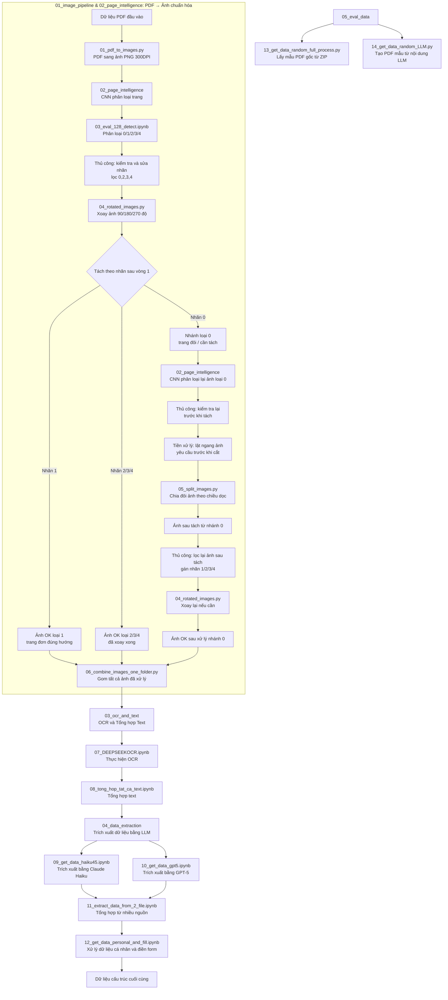

LINK CỦA DỰ ÁN: [Link](https://rag-llm-app-6ot7kxx9onfu9p5hizqmab.streamlit.app/)

#  RAG Chatbot - PDF Q&A

**Mô tả ngắn:**  
Ứng dụng web đơn giản bằng **Streamlit** cho phép người dùng **tải lên file PDF**, hệ thống sẽ **trích xuất văn bản**, **tạo vector database (FAISS)** bằng embedding của Google Generative AI, và dùng **RAG (Retrieval-Augmented Generation)** để trả lời câu hỏi dựa trên nội dung PDF.

---

##  Mục tiêu dự án
- Cho phép người dùng nhanh chóng biến một tài liệu PDF thành một **chatbot Q&A**.
- Trả lời trực tiếp **dựa trên nội dung trong file** (không suy đoán ngoài tài liệu).
- Hỗ trợ tiếng Việt (prompt đã tối ưu cho tiếng Việt).
- Dễ deploy (Streamlit) và dễ mở rộng.

---

##  Tính năng chính
- Upload file PDF từ giao diện web.
- Trích xuất văn bản dùng **PyPDF2**.
- Chia nhỏ văn bản (chunking) bằng **RecursiveCharacterTextSplitter**.
- Tạo embedding với **GoogleGenerativeAIEmbeddings**.
- Lưu vector bằng **FAISS** và truy vấn bằng **RetrievalQA** (LangChain).
- Sinh trả lời bằng **Google Gemini (gemini-1.5-flash)**.
- Giao diện Streamlit: upload, tiến trình, hiển thị lịch sử chat, xử lý lỗi.

